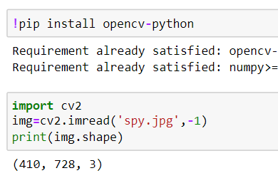

# READ AND WRITE AN IMAGE
## AIM
To write a python program using OpenCV to do the following image manipulations.
i) Read, display, and write an image.
ii) Access the rows and columns in an image.
iii) Cut and paste a small portion of the image.

## Software Required:
Anaconda - Python 3.7
## Algorithm:
### Step1:
Choose an image and save it as a filename.jpg
### Step2:
Use imread(filename, flags) to read the file.
### Step3:
Use imshow(window_name, image) to display the image.
### Step4:
Use imwrite(filename, image) to write the image.
### Step5:
End the program and close the output image windows.
## Program:
### Developed By: Jeeva Abishake
### Register Number: 212221240018
i) #To Read,display the image
```python
import cv2
img = cv2.imread('spy.jpg', -1)
resized_img = cv2.resize(img1, (364, 205), interpolation=cv2.INTER_LINEAR)
cv2.imshow('212221240018_JeevaAbi', resized_img)
cv2.waitKey(0)
cv2.destroyAllWindows()
  

```
ii) #To write the image
```python
import cv2
img=cv2.imread('spy.jpg',-1)
cv2.imwrite('writed_image.png',img)


```
iii) #Find the shape of the Image
```python
import cv2
img=cv2.imread('spy.jpg',-1)
print(img.shape)


```
iv) #To access rows and columns

```python
import cv2
img = cv2.imread('spy.jpg', -1)
resized_img = cv2.resize(img, None, fx=0.5, fy=0.5, interpolation=cv2.INTER_LINEAR)
for i in range(100,150):
    for j in range(100,120):
        resized_img[i][j]=[255,250,255] #blue green red
cv2.imshow('212221240018_JeevaAbi',resized_img);
cv2.waitKey(0)
cv2.destroyAllWindows()


```
v) #To cut and paste portion of image
```python
import cv2
img = cv2.imread('spy.jpg', -1)
resized_img = cv2.resize(img, None, fx=0.1, fy=0.1)
copied_portion = resized_img[70:150, 60:220] 
destination_area = resized_img[60:140, 25:185] 
if destination_area.shape == copied_portion.shape:
    resized_img[60:140, 25:185] = copied_portion
else:
    print("Shapes of source and destination areas do not match!")
cv2.imshow('212221240018_JeevaAbi', resized_img)
cv2.waitKey(0)
cv2.destroyAllWindows()


```

## Output:

### i) Read and display the image


### ii)Write the image


### iii)Shape of the Image



### iv)Access rows and columns


### v)Cut and paste portion of image


## Result:
Thus the images are read, displayed, and written successfully using the python program.
